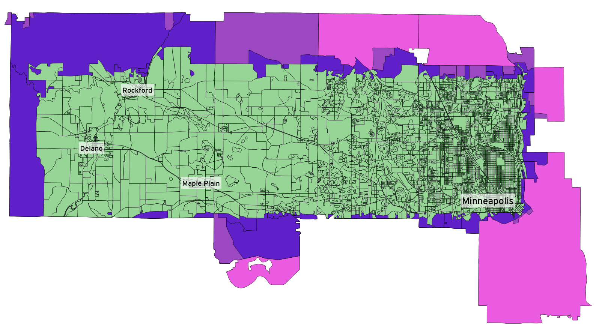
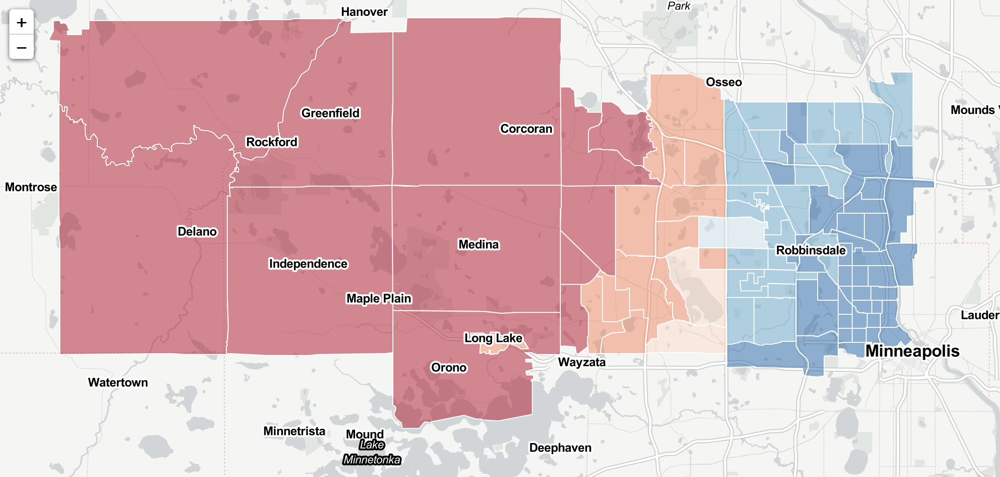
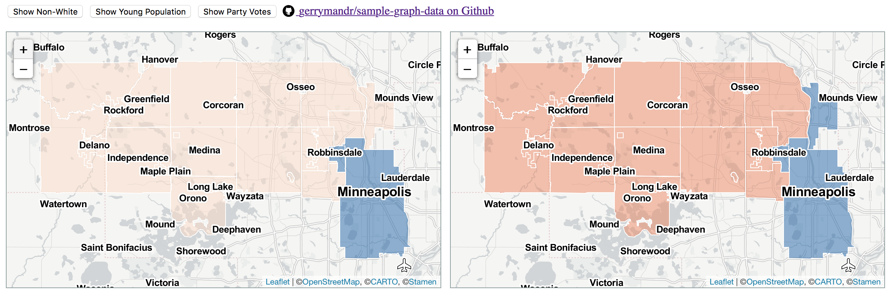
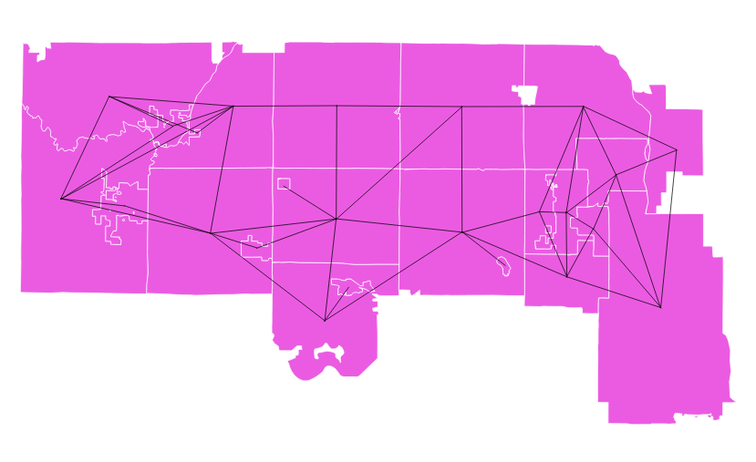
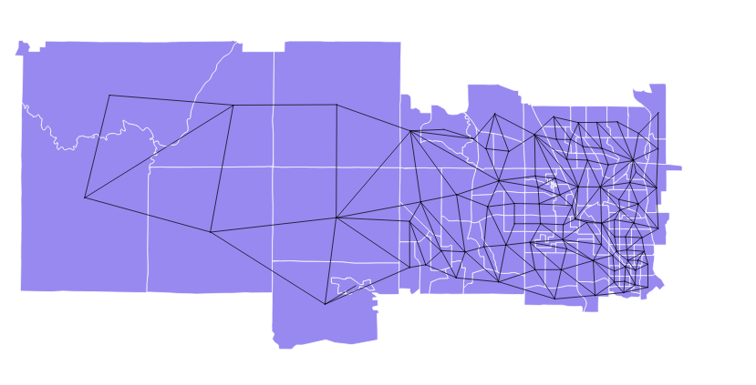
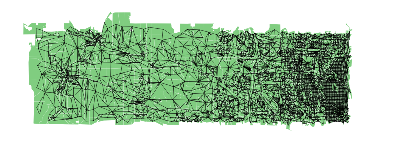

Sample Electoral Data
===

This repo contains sample electoral data, including adjacency graphs, units
at various scales, demographic data, and past election results. We’ve started
with [data from Minnesota’s Legislative Coordinating Commission](http://www.gis.leg.mn/html/download.html)
covering [an area to the north and west of Minneapolis](MN-sample-area.geojson)
with a mix of urban, rural, white, non-white, conservative, and liberal voters.

See [an interactive map of demographics and voting patterns](http://bl.ocks.org/migurski/raw/ac29249b3c7bf7a481d8cf5a4ea52991/)
(source code in [map.html](map.html)).

Also see [an interactive map of several generated plans](http://bl.ocks.org/migurski/raw/d88485915f4ddcaaafc33a0c0cfda493/)
(source code in [maps.html](maps.html)).

Layers
===

Four layers are included: minor civil divisions (MCDs), Census tracts, voter
tabulation districts (VTDs), and Census blocks. Raw data and adjacency lists
for graph representations are included for each. Each includes demographic and
race data [detailed in _metadata_](http://www.gis.leg.mn/metadata/redist2010.htm).

Minor Civil Divisions
---

- Size: 24 units, 46 edges
- ID field: `MCD`
- Adjacency list: [mcd2010-graph.csv](mcd2010-graph.csv)
- Shapefile: [mcd2010-slice.zip](mcd2010-slice.zip)
- CSV: [mcd2010-slice.csv](mcd2010-slice.csv)

Census Tracts
---

- Size: 94 units, 228 edges
- ID field: `TRACT`
- Adjacency list: [tracts2010-graph.csv](tracts2010-graph.csv)
- Shapefile: [tracts2010-slice.zip](tracts2010-slice.zip)
- CSV: [tracts2010-slice.csv](tracts2010-slice.csv)

Voter Tabulation Districts
---

- Size: 133 units, 334 edges
- ID field: `VTD`
- Adjacency list: [vtd2010-graph.csv](vtd2010-graph.csv)
- Shapefile: [vtd2010-slice.zip](vtd2010-slice.zip)
- CSV: [vtd2010-slice.csv](vtd2010-slice.csv)

Census Blocks
---

- Size: 5,358 units, 12,802 edges
- ID field: `BLOCK`
- Adjacency list: [blk2010-graph.csv](blk2010-graph.csv)
- Shapefile: [blk2010-slice.zip](blk2010-slice.zip)
- CSV: [blk2010-slice.csv.gz](blk2010-slice.csv.gz)

Enumerating Partitioning Schemes
===
We used the [python-igraph](http://igraph.org/python/) in order to prototype enumerating possible partitioning schemes. See the [generate_partitions.py](generate_partitions.py) file for doing this enumeration:

    $ python generate_partitions.py mcd2010-slice.csv mcd2010-graph.csv 
    Number of partitions: 5
    [1, 2, 2, 2, 2, 2, 2, 2, 2, 1, 2, 2, 2, 2, 2, 2, 2, 2, 2, 2, 2, 2, 2, 2]
    [1, 2, 2, 2, 2, 2, 2, 1, 2, 1, 2, 2, 2, 2, 2, 2, 2, 2, 2, 2, 2, 2, 2, 2]
    [1, 2, 2, 2, 2, 2, 2, 2, 1, 1, 2, 2, 2, 2, 2, 2, 2, 2, 2, 2, 2, 2, 2, 2]
    [1, 1, 1, 2, 1, 1, 1, 1, 1, 2, 1, 1, 1, 1, 1, 1, 1, 1, 1, 1, 1, 1, 1, 2]
    [1, 2, 2, 1, 2, 2, 2, 2, 2, 1, 2, 2, 2, 2, 2, 2, 2, 2, 2, 2, 2, 2, 2, 2]

Each of these lines corresponds to a partitioning of the MCD's in the input files, which can then be visualized by editing [maps.html](maps.html).
