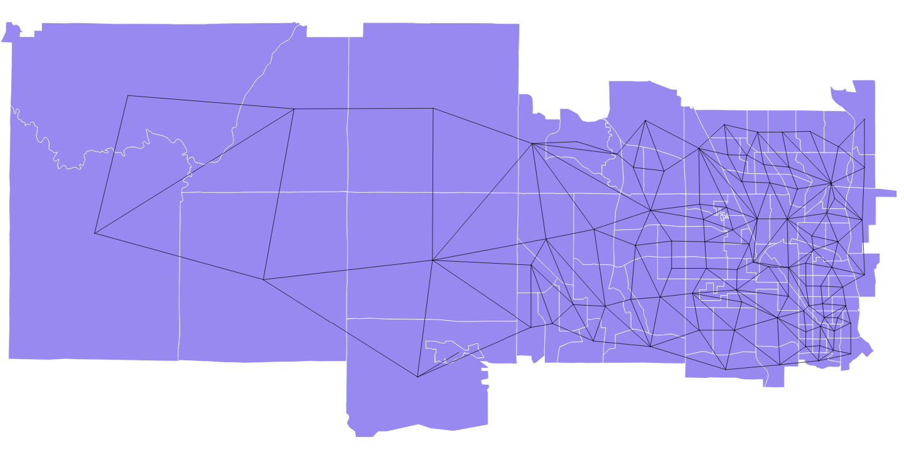

Sample Electoral Data
===

This repo contains sample electoral data, including adjacency graphs, units
at various scales, demographic data, and past election results. We’ve started
with [data from Minnesota’s Legislative Coordinating Commission](http://www.gis.leg.mn/html/download.html)
covering [an area to the north and west of Minneapolis](MN-sample-area.geojson)
with a mix of urban, rural, white, non-white, conservative, and liberal voters.

Four layers are included: minor civil divisions (MCDs), Census tracts, voter
tabulation districts (VTDs), and Census blocks. Raw data and adjacency lists
for graph representations are included for each. Each includes demographic and
race data [detailed in _metadata_](http://www.gis.leg.mn/metadata/redist2010.htm).

